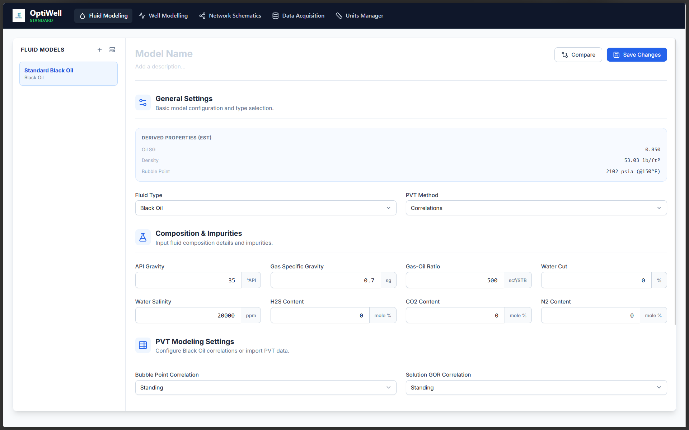

# Introduction  

Welcome to the **OptiWell User Manual**.

OptiWell is a well optimization application designed to support fluid modeling, well modeling, network schematics, data acquisition, and units management workflows in a structured engineering environment.

This manual provides the information needed to understand the application, navigate its features, and apply it in practical well optimization tasks.

# Purpose of This Manual

This user manual is intended to help users:

- Understand the purpose and scope of the OptiWell application
- Learn the main workflows and modules available in the platform
- Follow step-by-step guidance for using key features
- Review worked examples and usage scenarios
- Support onboarding for engineers, analysts, and contributors

# Manual Structure

This documentation is organized into three main sections:

## Technical Overview

The technical overview explains the overall architecture, design intent, major modules, and engineering concepts behind the application.

## User Guide

The user guide provides practical instructions for navigating the interface and using each feature of the application.

## Examples

The examples section demonstrates how OptiWell can be applied in realistic workflows and engineering scenarios.

# Main Application Modules

The OptiWell interface is organized around the following core modules:

## Fluid Modeling

Used for defining fluid models and configuring PVT-related properties, correlations, and composition inputs.

## Well Modelling

Used for describing well configurations, performance parameters, and well-level optimization settings.

## Network Schematics

Used for representing connected production systems and flow relationships across assets.

## Data Acquisition

Used for importing, managing, and reviewing source engineering data required by the platform.

## Units Manager

Used for handling engineering units and ensuring consistency across calculations and workflows.

# Intended Audience

This manual is intended for:

- production engineers
- reservoir and petroleum engineering users
- field and operations analysts
- technical evaluators
- contributors and maintainers of the documentation

# Getting Started

To begin using this manual, start with the following sections:

- [Technical Overview](technical-overview.qmd)
- [User Guide](user-guide.qmd)
- [Examples](examples.qmd)

# Notes for Contributors

Documentation contributors should also refer to:

- [Contribution Guide](contribution-guide.qmd)
- [Installation Guide](installation-guide.qmd)