This section provides step-by-step instructions for using OptiWell.

## Fluid Modeling Menu
This is used to create and manage fluid models. Fluid models can be created by selecting the add icon in the sidebar. All existing models can also be seen in the sidebar. Three input groups are required for fluid modeling, which include General Settings, Composition and Impurities, and PVT Modeling Settings.

### General Settings:  

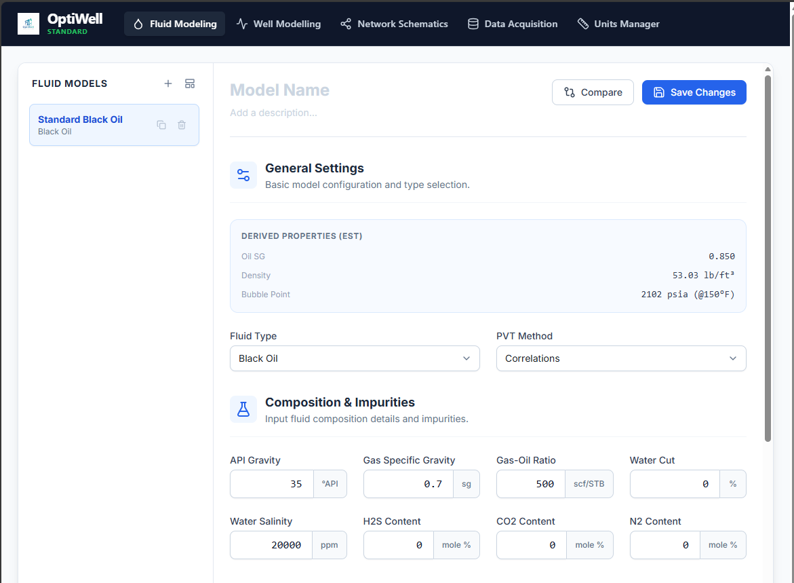{#fig-general_settings}  

This has two select inputs, Fluid type and PVT Method. The fluid types are, 

- Black Oil  
- Compositional  
- Dry Gas  
- Wet Gas 

The PVT methods are, 

- Correlations
- Lift table

### Composition and Impurities  

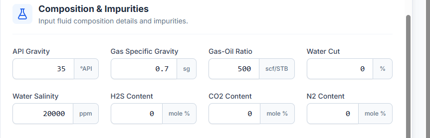{#fig-composition_and_impurites}  

This presents input fields for the fluid properties in field units as the 
default units. The available fields include,  

- API Gravity
- Gas Specific Gravity
- Gas-Oil Ratio (GOR)
- Water cut
- Water Salinity
- H2S Content
- CO2 Content
- N2 Content

where H~2~S, CO~2~, and N~2~ are impurities.

### PVT Modeling Settings  

The following correlations are implemented for the bubble point, Solution gas oil ratio and oil formation volume factor calculation,  

- Glaso
- Kartoatmodjo and Schmidt
- Vazquez and Beggs
 
The Oil viscosity correlations include,  

- Kartoatmodjo and Schmidt 
- Beggs-Robinson

#### Preview PVT Plots  

Selecting the button displays profiles of the following calculated properties  

- Solution GOR (Rs)
- Oil formation volume factor (Bo)
- Oil Viscosity  

#### Saving a Model
After entering the fluid properties and selecting the black oil and oil viscosity correlations, the fluid model can be renamed, optionally given a description, and saved by selecting “Save Changes.”

#### Compare
This button helps you to compare any two saved PVT models

## Well Modeling Menu  

{#fig-well_modeling}  

This is used to create and manage well models. There are five tabs in the well modeling menu.  

- Fluid Props  
- Reservoir  
- Wellbore  
- Production  
- Results  

### Fluid Props  

#### Fluid Selection 

This is used to select the fluid model associated with the well from existing fluid models.

### Reservoir  

{#fig-reservoir_tab}   

This view is used to collect the inputs and options for evaluating the Inflow Performance. The following are the input fields and options. 

#### IPR Calculation Model
Two IPR calculation choices are available in this select field  

- PI Entry 
- Vogel
- Custom Table

#### Reservoir Pressure  
Enter the reservoir pressure here. The default unit is psia.  

#### Reservoir Temperature  
This is the input field for the reservoir temperature. The default unit is degrees Fahrenheit.

#### Bubble Point Pressure  
This is the input field for the Bubble point pressure.  

#### Productivity Index (J)  
This is the input field for the productivity index.  

#### Generate IPR Curve Preview  
Clicking this button displays a preview of the IPR plot  

### Wellbore  

{#fig-wellbore_tab}  

This tab contains all the inputs and options required to model the wellbore and surface flowline.

#### Downhole Equipment  
<!--    -->

Each row of data inputs here describes a downhole equipment. An equipment should have a label, type, measured depth, diameter, and roughness.

##### Label  
The Label can be any name you choose. 

##### Type  
Depending on your specific wellbore equipment, the type can be any of the following.  

- Wellhead  
- Tubing  
- Casing  
- SSSV  
- Restriction  

##### MD (FT)  
This is the measured depth of the equipment. The measured depth marks the bottom depth of the equipment. The default unit is in feet.  

##### ID (IN)  
This is the inner diameter of the pipe segment in inches.  

##### OD (FT)  
This is the outer diameter of the pipe segment in inches.

##### ROUGHNESS (IN)  
This is the roughness of the pipe segement in inches.  

#### Deviation Survey  

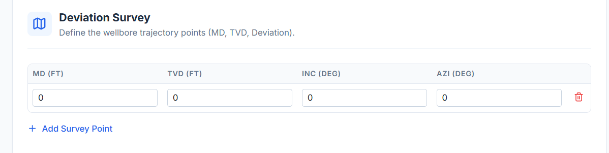{#fig-deviation_survey}  

This defines the wellbore trajectory points. The input fields include  

- MD (FT): Measured depth in feet.
- TVD (FT): True vertical depth in feet.
- INC (DEG): inclination angle in degrees. 
- AZI (DEG) : Azimuth is the horizontal directional angle of the wellbore relative to a reference direction.  

The MD and TVD is sufficient for deviation survey. The INC and AZI are computed internally.  

##### Add Equipment  
Thsi button is used to add a row of downhole equipment.  

##### View Schematic  
Clicking this button displays a schematic based on the entered downhole equipment.  

#### Analysis Node  

{#fig-analysis_node}  

The analysis node determines at which depth the inflow (IPR) and outflow (VLP) pressures are equated. Bottom Hole is standard for system-level analysis. The following options are available.  

- Bottom Hole  
- Wellhead  
- Mid-Perforations  
- Custom Depth  

#### Artificial Lift - Gas Lift  

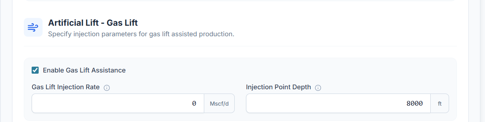{#fig-artificial_gas_lift}  

Selecting the checkbox specifies displays the input fields for the gas lift parameters.  

##### Gas Lift Injection Rate  
This is the gas lift injection rate in Mscf/d.  

##### Injection Point  
This is the measured depth of the injection point in feet.  

#### Well Pressure Drop Model  

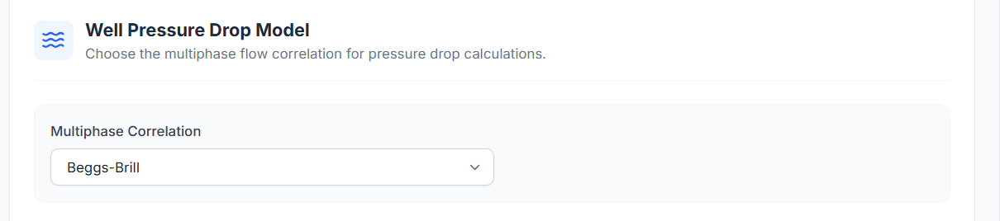{#fig-well_pressure_drop_model}  

This select input is used to select the multiphase correlation to be used for pressure drop calculations. The choices include,  

- Beggs-Brill  
- Hagedorn-Brown  
- Duns-Ros  
- Mukherjee-Brill

#### Well Temperature Model  

{#fig-well_temperature_model}

The options here are used to model the fluid temperature along the wellbore.  

##### Temperature Model  

The options are used to select the temperature modeling method to use. The availabel options are,  

- Linear (Res to Wellhead)  
- Rough Approximation  

###### Linear (Res to Wellhead)  

On selecting this option, the only input field presented is the Wellhead Temperature (Twh) with the default unit in degree fahrenheit.  

###### Rough Approximation  

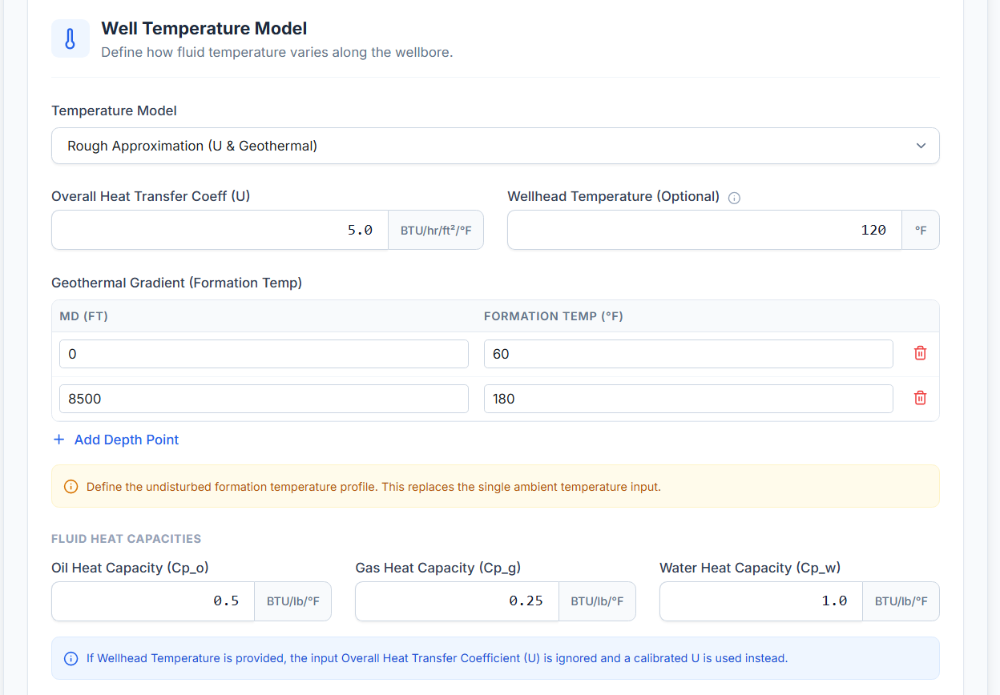{#fig-rough_approximation}  

The Rough approximation method requires the following inputs.  

**Overall Heat Transfer Coeff (U):** For entering the value of the overall heat transfer coefficient.  
**Wellhead Temperature (Optional):** The value of the temperature at the wellhead is entered here.  

**Geothemal Gradient (Formation Temp):** To compute the geothermal gradient, 

- MD (measured depth) 
- Formation Temp (formation temperature)  

at different depth points are entered by clicking the "Add Depth Point" button.  

**Fluid Heat Capacities:** The required heat capacity inputs are,  

- Oil Heat Capacity  
- Gas Heat Capacity  
- Water Heat Capacity  

If Wellhead Temperature is provided, the input Overall Heat Transfer Coefficient (U) is ignored and a calibrated U is used instead.  

#### Surface Equipment/Flowline  

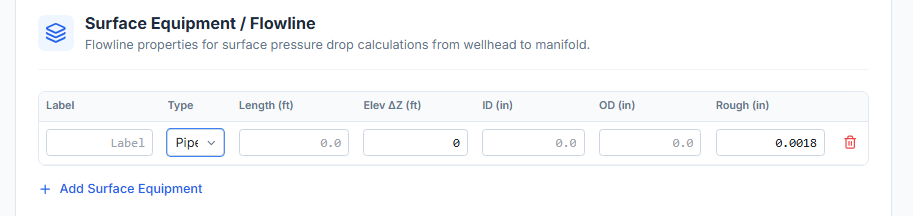{#fig-surface_equipment}  

The flowline equipments from wellhead to the manifold are defined for flowline calculations. The equipment properties required as presented are,  

- Label: the name assigned to the equipment  
- Type: the type of the equipment. It can either be a Pipe or a Choke.  
- Length: denotes the lenght of the equipment  
- Ele $\Delta Z$: is the elevation of the equipment with the reference plane.  
- ID: is the inner diameter of the equipment  
- OD: is the outer diameter of the equipment  
- Rough: is the internal roughness of the equipment  

**Add Surface Equipment**: This button is used to add row entries for surface equipment.  

#### Flowline Pressure Drop Model  

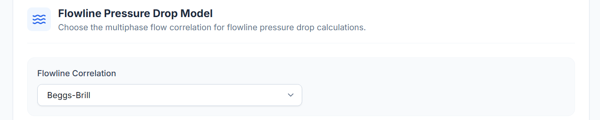{#fig-flowline_pressure_drop_model}  

This is used to select the pressure drop correlation for calculating the fluid pressure drop along the flowline. The two models available are,  

- Beggs and Brill 
- Mukherjee Brill

#### Flowline Temperature Model  

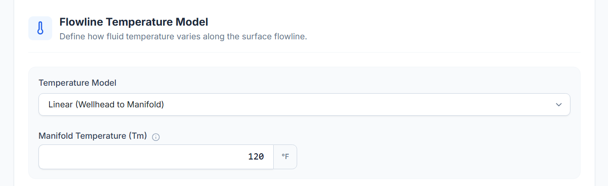{#fig-flowline_temperature_model}  

##### Temperature Model Choices
This has two chioces, 

- Linear  
- Rough Approximation  

###### Linear 
Manifold Temperature is the only input required for Linear model.  

###### Rough Approximation  

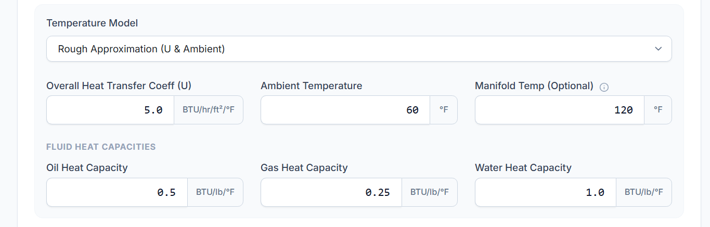{#fig-flowline_rough_approximation}  

Selecting the Rough Approximation Temperature model shows the following list of inputs.  

- Overall Heat Transfer Coefff  
- Ambient Temperature  
- Manifold Temp: Temperature of the fluid at the manifold  
- Fluid Heat Capacities: The three inputs here are,  
  - Oil Heat Capacity  
  - Gas Heat Capacity  
  - Water Heat Capacity  

#### Generate Preview  

{#fig-generate_preview_curve}  

This is used to generate preview based on the preview type. The preview type choices available are,  

- VLP curve  
- Gradient Traverse curve.  

The Rate spacing defines the divisions on the fluid rate. The Rate Spacing choices are, 

- Linear, and 
- Geometric.  

### Production Data  

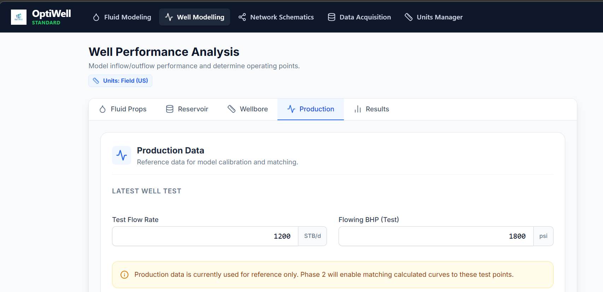{#fig-production_data_tab}  

On this tab data from well tests are entered. The input fields include,  

- Test Flow Rate in STB/d
- Flowing BHP in psi  

## Network Schematics Menu  

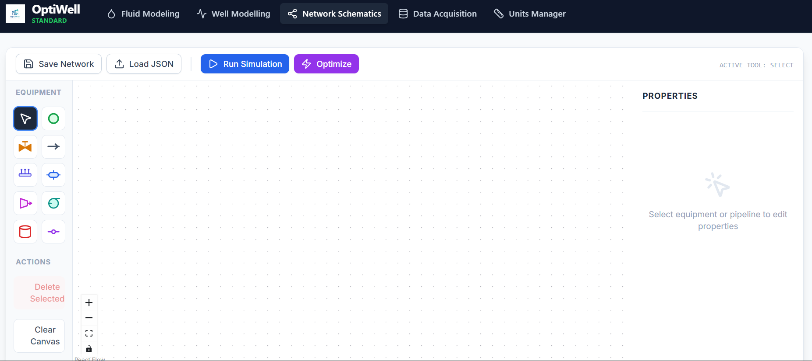{#fig-network_schematics_menu}  

This menu and tab is used to build the network. It has preset palletes(representing the network components) and properties tab used to configure the network components. Using the drag and drop feature the palletes are used to build the network on the canvas. The following are the available components.  

- Well 
- Choke 
- Pipeline 
- Manifold 
- Separator 
- Compressor 
- Pump 
- Junction

Each of the above components properties can be configured in the properties sidebar. The following are the components and configurable properties.

### Well 
The Node label is used to uniquely identify the well in the network. The following parameters and constraints can be set on the well.  

**a. Parameters.**

- Res. Pressure (psia): Input field for the reservoir pressure in psia.
- Productivity index: Enter the value of the productivity index.
- IPR Model: This field is for the selected choice of IPR model.
- Res. Temp (F): For the reservoir temperature in degF. 
- GOR (scf/STB): Fluid GOR in scf/STB.
- Water Cut (%): Input field for entering the water cut value.
- WHP (psia): Input for the value of the wellhead pressure in psia.

**b. Optimisation Constraints.**  
The following are the constraints on the well. 

- Max Drawdown (psia): Input for the value of the maximum drawdown for the well in psia.
- Min WHP (psia): Value for the minimum wellhead pressure in psia.
- Max Rate (STB/d) 

### Choke 
The Node label is used to uniquely identify the choke in the network. The following are parameters and Optimisation constraints that can be set on the choke. 

**a. Parameters.** 

- Bean size (1/64") 
- Cv Coefficient

**b. Optimisation Constraints.**  

- Min Delta P: Minimum value for delta P.
- Max Delta P: Maximum value for delta P.

### Manifold  
The manifold like other components has a label and some parameters.  
**Parameters**  

- Inlets: defines the number of inlets on the manifold.
- Pressure rating: input for the value of the pressure rating on the manifold.
- Elevation (ft): Elevation of the manifold in ft. 

### Compressor 
It has a label that is a unique identifier in the network, a few parameters and an optimisation constraint.  

**a. Parameters.**  

- Discharge Press (psia): This is the discharge pressure measured in psia. 
- Power (hp): The power rating on the compressor
- Efficiency (%): The efficiency of the compressor 

**b. Optimisation Constraints.**  

- Max Comp Ratio: The maximum compressor ration of the compressor.

### Pump

The pump has a label.

**a. Parameters.**  

- Delta P (psi): The Delta P (change in pressure) in psia.
- Power (hp): The power rating of the pump in horse power.
- Efficiency (%): The efficiency of the pump.

### Tank 

The Storage Tank has a label in the network.  

**a. Parameters.**  

- Capacity (bbl): The tank storage capacity in barrels.
- Level (%): The tank level in percentage.
- Fluid Type: The type of fluid.
- Tank Pressure: The pressure in the tank in psia.
- Tank Temp: The temperature in the tank. 

**b. Optimisation Constraints.**

- Max Level (%): The maximum level of the tank.  

### Junction  

The Junction has a label and a few parameters.

**a. Parameters.**  

- Elevation (ft): The elevation of the junction above the ground in ft.  
- Type: The type of junction.
